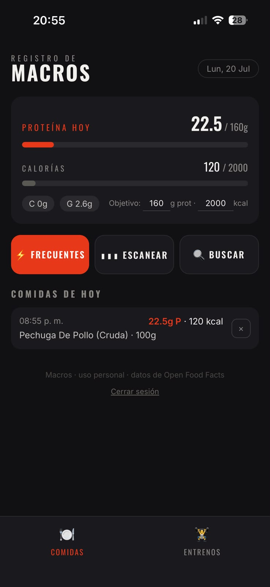
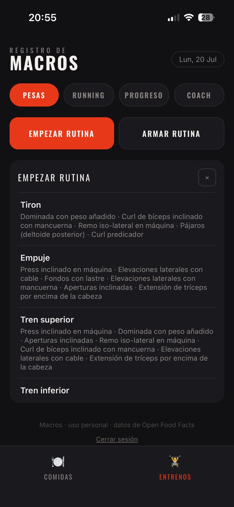
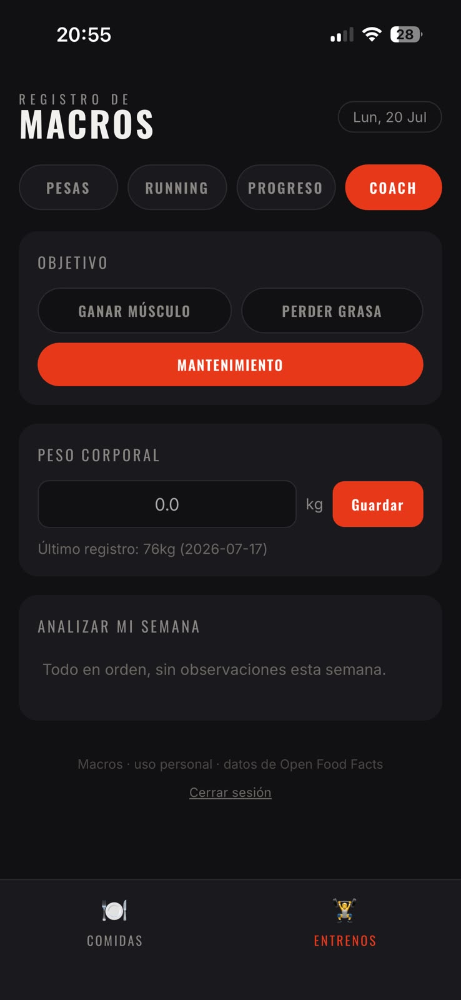

# Macros — PWA de nutrición y entrenamiento

Progressive Web App para el registro diario de comidas, macros y entrenamientos,
con análisis automático de progreso. Desarrollada como proyecto personal,
pensada para instalarse en el teléfono y funcionar como una app nativa.

**Stack:** React · Vite · Supabase · ZXing · Open Food Facts API

### 🔗 [Ver demo en vivo →](https://app-fitness-2i2.pages.dev/)

> **Acceso de prueba:** usuario `demo@demo.com` · contraseña `demo1234`
> *(La app es de uso personal; usá esta cuenta para explorarla.)*

---

## ✨ Funcionalidades

### 🍎 Nutrición
- **Escaneo de código de barras** de productos envasados (ZXing) que trae los macros exactos desde Open Food Facts.
- **Búsqueda por nombre** en la base nutricional colaborativa de Open Food Facts.
- **Alimentos frecuentes** de acceso instantáneo, disponibles offline.
- Cálculo automático de proteínas y calorías según los gramos ingresados, con registro separado por día.

### 🏋️ Entrenamiento
- Registro de rutinas de **pesas** con selección de ejercicios y seguimiento de series.
- Registro de sesiones de **running**.
- Panel de progreso con la evolución de los entrenamientos.

### 📊 Coach automático
- Motor de análisis **por reglas** (determinístico) que evalúa los datos cargados y sugiere ajustes semanales.
- Analiza el cumplimiento del objetivo de proteína y la constancia del entrenamiento sobre las últimas semanas.

---

## 🛠️ Tecnologías

| Área | Tecnologías |
|------|-------------|
| Frontend | React 18, Vite |
| Backend / Auth | Supabase (autenticación + PostgreSQL) |
| Escaneo | ZXing (lectura de códigos de barras en navegador) |
| Datos nutricionales | Open Food Facts API |
| Deploy | Cloudflare Pages (PWA instalable) |

---

## 🚀 Instalación local

```bash
# Clonar el repositorio
git clone https://github.com/FedericoLongo1/app-fitness.git
cd app-fitness

# Instalar dependencias
npm install

# Configurar variables de entorno
cp .env.example .env
# Completar VITE_SUPABASE_URL y VITE_SUPABASE_ANON_KEY con tus credenciales de Supabase

# Levantar en modo desarrollo
npm run dev
```

La base de datos se inicializa con el esquema en `supabase/schema.sql`.

---

## 📱 Instalar en el teléfono (PWA)

1. Abrí la URL del deploy en el navegador del celular.
2. Menú del navegador → **"Agregar a inicio"**.
3. Al usar el escáner por primera vez, aceptá el permiso de cámara.

---

## 🏗️ Arquitectura

La app está organizada por dominios funcionales:
- **Comidas** — registro nutricional, escaneo y búsqueda de alimentos.
- **Entrenos** — pesas y running, con selección de ejercicios y paneles de rutina.
- **Coach / Progreso** — análisis de datos y sugerencias basadas en reglas.
- **Auth** — gestión de sesión con Supabase.

---

## 📸 Capturas

<p align="center">
  
  
  
</p>

<p align="center">
  <sub>Registro de macros · Rutinas de entrenamiento · Coach con análisis semanal</sub>
</p>
Los datos se persisten en Supabase, con soporte offline para las funciones básicas.

---

<sub>Proyecto personal en desarrollo continuo · Datos nutricionales provistos por Open Food Facts</sub>
